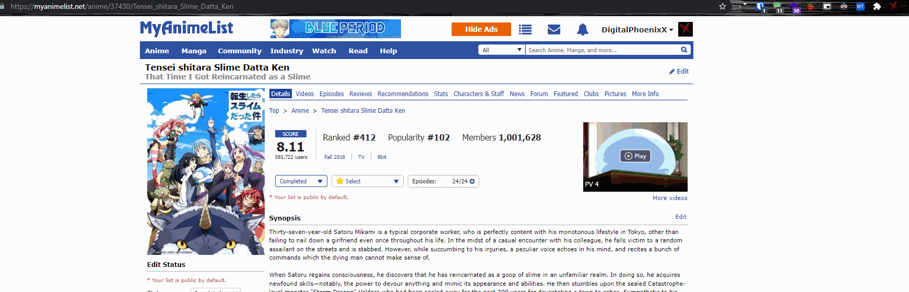
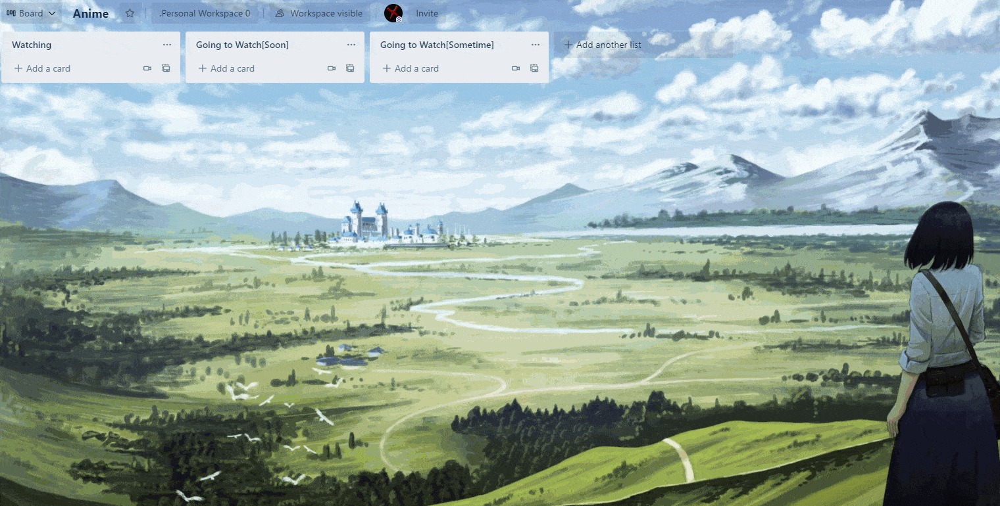
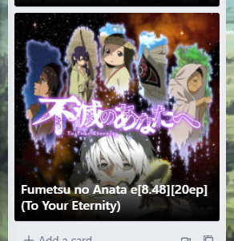

# MAL Trello Card Generator

[![GitHub Release][github_release_badge]][github_release_link]
[![License][license-image]][license-url]

A chrome extension that copies data from an open MAL page then paste it into a Trello card. Copied Data Highlights(Title, Score, Episodes count, cover image URL, ...).

> Refresh Trello if it was open before installing the extension

## How to Use

### Copy data from MAL

### Create card on Trello

### The final Trello Card

## Installing Extension

Currently, I don't have a Chrome Web Store listing for this extension since it requires an initial fee (albeit $5) and I just made this extension for fun and learning purposes.

## Adding Extension From Code

Clone the repo then follow the instruction on [Getting started - Chrome Developers (Manifest Section)](https://developer.chrome.com/docs/extensions/mv3/getstarted/#manifest).

## Authors

* **Mohamed Said Sallam** - Main Dev - [TheDigitalPhoenixX](https://github.com/TheDigitalPhoenixX)

## License

This project is licensed under the MIT License - see the [LICENSE](LICENSE) file for details

[license-image]: https://img.shields.io/badge/License-MIT-brightgreen.svg
[license-url]: https://opensource.org/licenses/MIT

[github_release_badge]: https://img.shields.io/github/v/release/TheDigitalPhoenixX/MALTrelloCardGenerator.svg?style=flat&include_prereleases
[github_release_link]: https://github.com/TheDigitalPhoenixX/MALTrelloCardGenerator/releases

[github-contributors]: https://github.com/TheDigitalPhoenixX/MALTrelloCardGenerator/contributors
[github-tags]: https://github.com/TheDigitalPhoenixX/MALTrelloCardGenerator/tags
